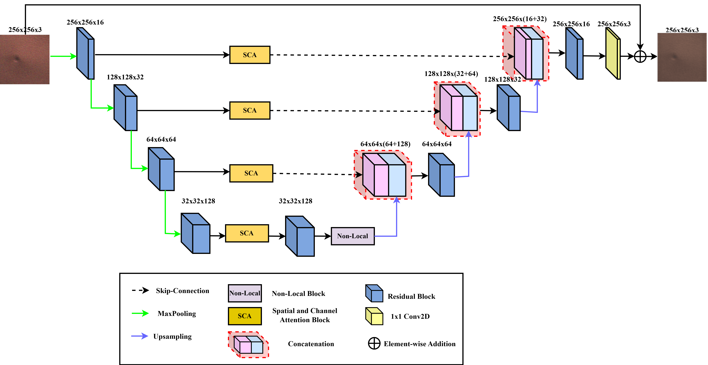
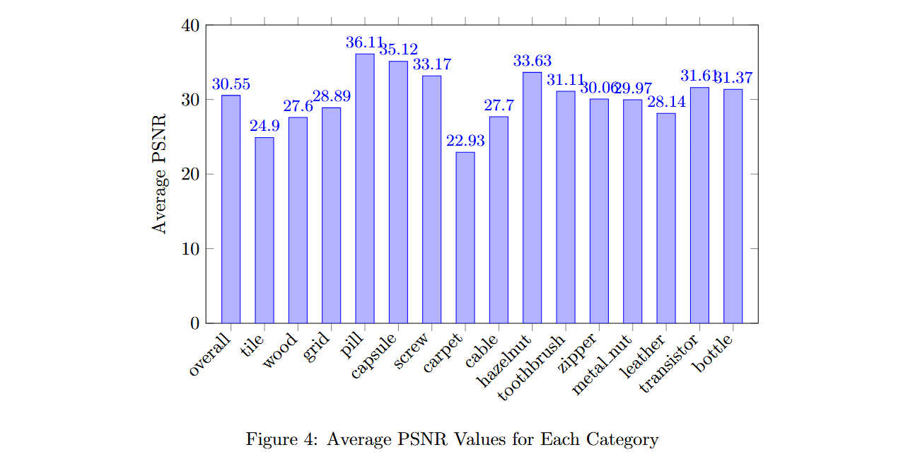
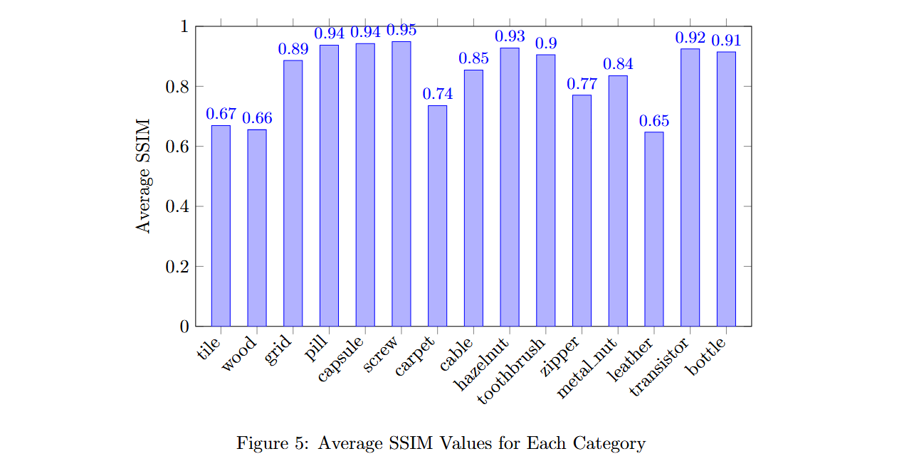

# EE5179-Deep-Learning-for-Imaging_KLA_Project

This repository contains the implementation of a novel deep learning model for image denoising and deblurring. The proposed architecture is built upon the U-Net framework and is enhanced with Spatial and Channel Attention (SCA) mechanisms and Non-Local Blocks to improve restoration quality and preserve defects of interest.

**Overview**

The model is designed to recover clean images from noisy and blurred inputs while preserving critical regions.

**Key architectural highlights**

U-Net Framework: For multi-scale feature extraction and reconstruction.

Spatial and Channel Attention: Dynamically prioritizes significant regions in the image.

Non-Local Block: Captures global dependencies to enhance restoration performance.

**Dataset**

The experiments use the **MVTec Anomaly Detection (AD) dataset**, modified to include artificially degraded images (noise and blur).
This dataset is organized into the following 15 categories: tile, wood, grid, pill, capsule, screw, carpet, cable, hazelnut, toothbrush, zipper, metal nut, leather, transistor, bottle

Training Set: 932 degraded images and corresponding clean ground truth.
Validation Set: 88 degraded images with corresponding clean ground truth.
Defect Masks: Provided to ensure critical regions are preserved during restoration.

## Experimental Settings
- Framework: PyTorch  
- GPU: NVIDIA T4
- Optimizer: Adam
- Learning Rate: 0.001
- Training Epochs: 250
- Loss Function: Combination of Charbonnier Loss, SSIM Loss, and Edge Loss.

**Evaluation Metrics**
Peak Signal-to-Noise Ratio (PSNR): Quantifies signal fidelity relative to noise.

Structural Similarity Index Measure (SSIM): Evaluates perceptual similarity.

**Results**
Average performance on the validation set:

PSNR: 30.55 dB

SSIM: 0.8450

